## Proyecto-DWI
Proyecto de desarrollo para l a materia de Desarrollo Web Integral

  <b>Tabla/Organigrama de roles 🧑‍💻</b>
 

  
  
| Colaborador | Nombre  | Rol | Periodo de Scrum Master |
|-------------|---------|-----|------------------------|
| @Denis-Castillo123 | **AGUILAR CASTILLO KARLA DENISSE**  | Development  | - [ ] 9 Mayo – 26 Mayo   - [ ] 31 Julio – 18 Agosto |
| @Araiza07 | **ARAIZA CERVANTES JESSY JAVIER**  | Development  | - [ ] 29 Mayo – 16 Junio |
| @Bucky2 | **BUCLÓN PEDROZA CRISTIAN ISRAEL**  | Development  | - [ ] 19 Junio – 7 Julio |
| @LuisGusDev | **GARCÍA CARRILLO LUIS GUSTAVO**  | Development  | - [ ] 10 Julio – 28 Julio |

```mermaid
graph TD;
  A((<b>SCRUM Master</b> <br><br> AGUILAR CASTILLO KARLA DENISSE))
  B((<b>Desarrollador</b> <br><br> AGUILAR CASTILLO KARLA DENISSE))
  C((<b>Desarrollador</b> <br><br> ARAIZA CERVANTES JESSY JAVIER))
  D((<b>Desarrollador</b> <br><br> BUCLÓN PEDROZA CRISTIAN ISRAEL))
  E((<b>Desarrollador</b> <br><br> GARCÍA CARRILLO LUIS GUSTAVO))
  A --> B
  A --> C
  A --> D
  A --> E
```  

